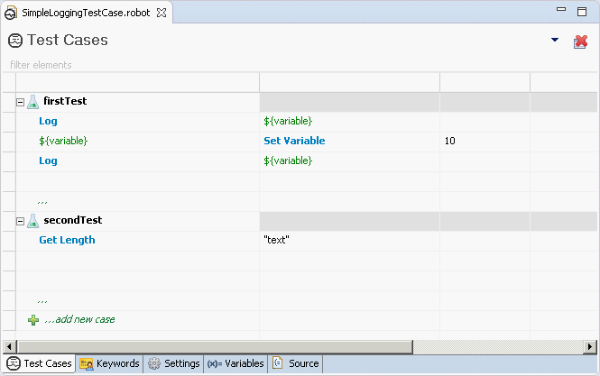
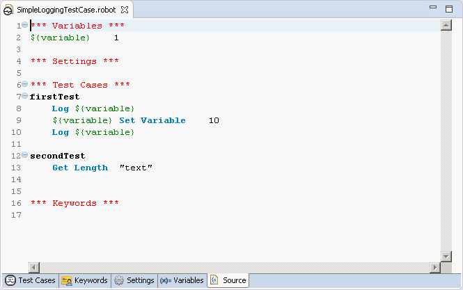
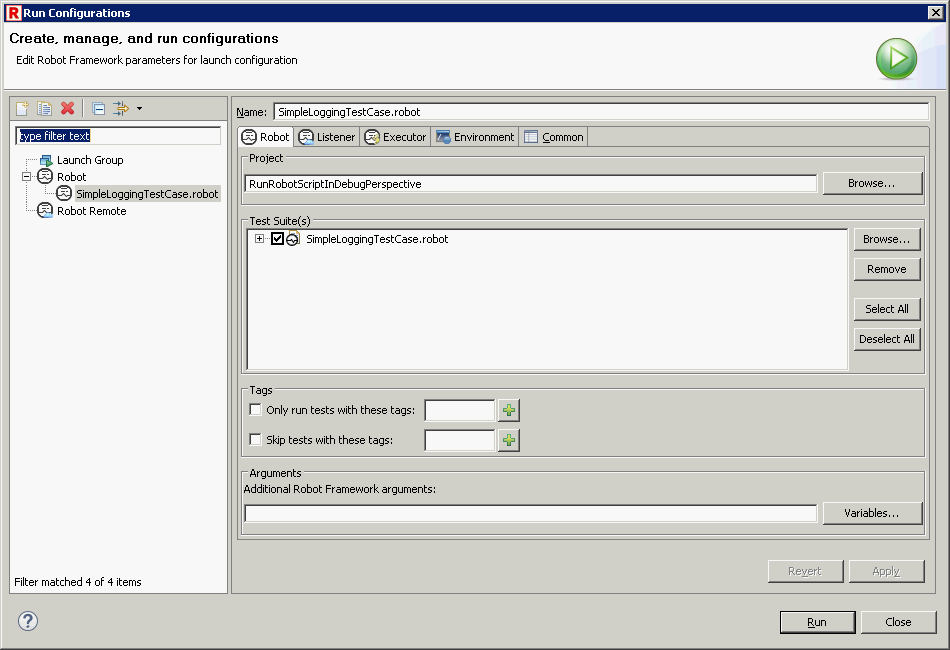
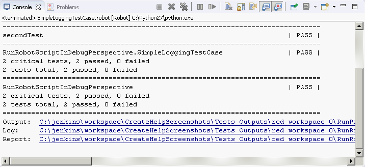
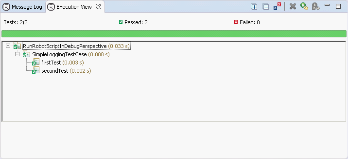

## Create project, add test and run

In order to start working with RED & Eclipse, you should set RED perspective.
In this perspective you can add robot project and test suites/resource files.
You can add python files too with variables or library schema.

### Robot Perspective

All RED activities are performed within 2 perspectives: _Robot_ , _Debug_.
Former one is used to construct and execute tests, later one is for debugging
test-cases. To start working with RED, you should activate Robot perspective
first.

  * Check if you have already set Robot perspective:   

  * Set perspective to Robot by issuing action: _Window -> Perspective -> Open Perspective -> Other ... -> Robot_

### Workspace & project

**Workspace** stores all global Eclipse  & Red preferences. If it not set
previously, Eclipse will show dialog to set path. User can always switch
workspaces, and if necessary, perform projects import from locations outside
of current workspace. Switching Workspace is done by menu action: _File ->
Switch Workspace ..._

**Project** is an equivalent to folder in OS, it stores files and settings
relevant to a group of files. In order to work with RED, **Robot Project** has
to be created.  
Creating new Project can be done by:

  * _File->New-> Robot Project_ (item can be found also under selection _New -> Project .. -> Robot Framework -> Robot Project_ )
  * Right click menu on Project Explorer with selection as above

If you wish to import anything into Workspace (i.e. already existing Project)
or into Project (existing test cases), menu _Import ..._ will open up wizard.
Upon creating Project, you should have see similar structure in Project
Explorer tree, which will also indicate that RobotFramework is visible to
Eclipse. 

### Create TestSuite

To create sample test you should invoke action: _File -> New -> Other ... ->
Robot Framework -> Robot Test Suite_. Same action can be accessed by right
click menu. RED consists of 2 different modes of editing: a Table (Ride-like
style) and Text style.  Four first tabs in Test Suites are table views. Last
on is text view (source). By default Source editor is used when Test Suite
file is opened.   Source view displays text
representation of all table views: 

#### Content assistant

Just like other modern Developments Environments, RED supports content
assistance/code completion.  When editing tab or item in text editor, press
CTRL+SPACE keys to activate hints for robot keywords an variables.

### Running TestSuite

To run TestSuite, _Run_ button needs to be selected or right-click menu on
file in Source view. The same action is in right-click menu on file in Project
Explorer. 

#### Limiting test cases to be run

To limit list of test cases to be run, open _Run Configurations ..._ ,  
 In Robot part you can specify which test cases
should be run by using either tags or include/exclude list of test cases in
active project.   To run single test
case in test suite, you can select desire test case in Project Explorer and in
right-click menu select "Run".

#### Console and message log

During TestSuite execution, RED displays RobotFramework console and message
logs. Those information are available in Console and Message Log, by default
visible in the Robot perspective or by _Window -> Show View -> Other.... ->
Robot_  If any of those 2 views are missing, best
way is to reset perspective settings by using action _Window -> Perspective ->
Reset Perspective ..._

#### Execution status

RED can show execution status of TestCases along with outcome result and
execution time. This view is in Robot perspective by default.
  
To open Execution go to: _Window-> Show View -> Robot -> Execution View_

[Return to Help index](http://nokia.github.io/RED/help/)
