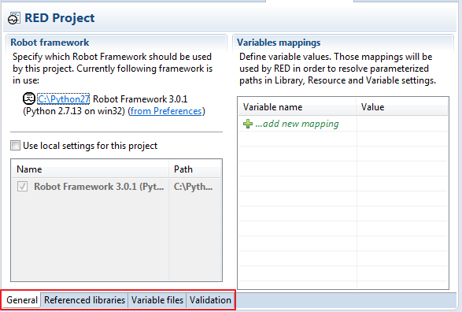
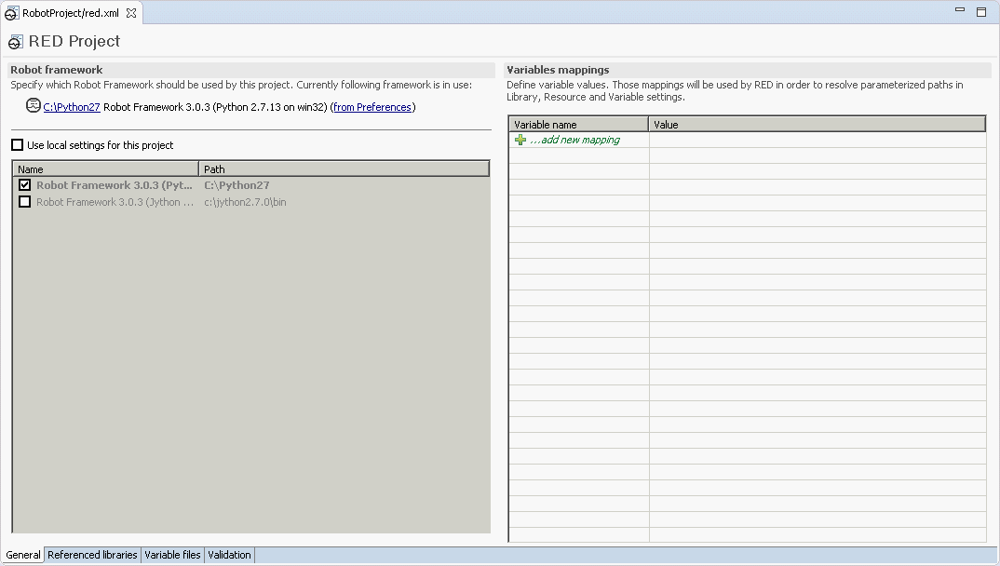
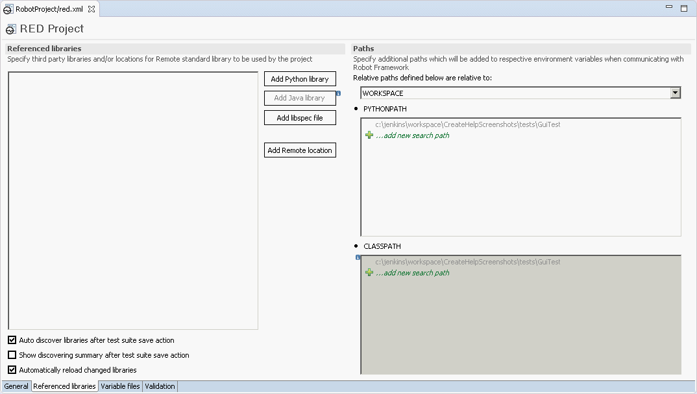
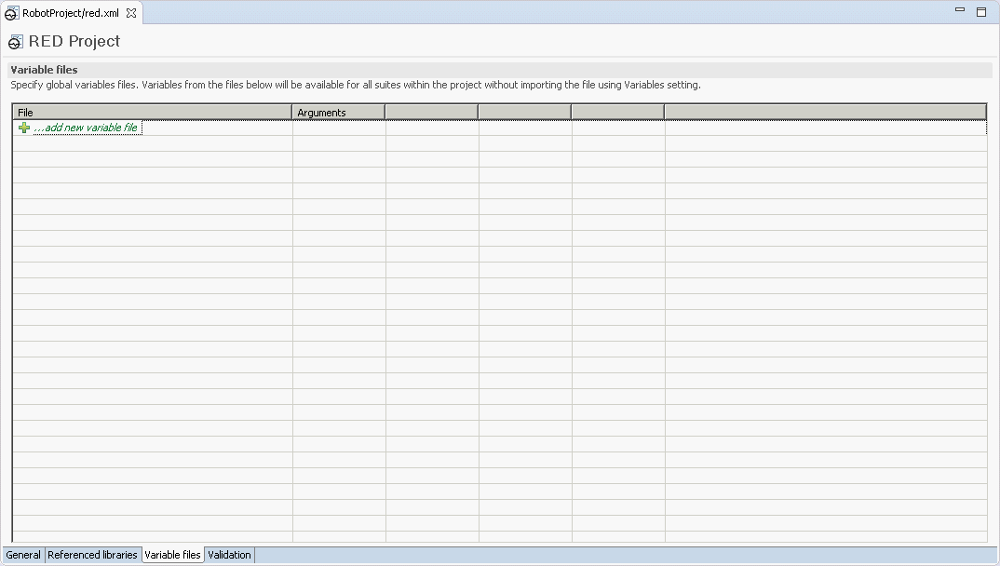
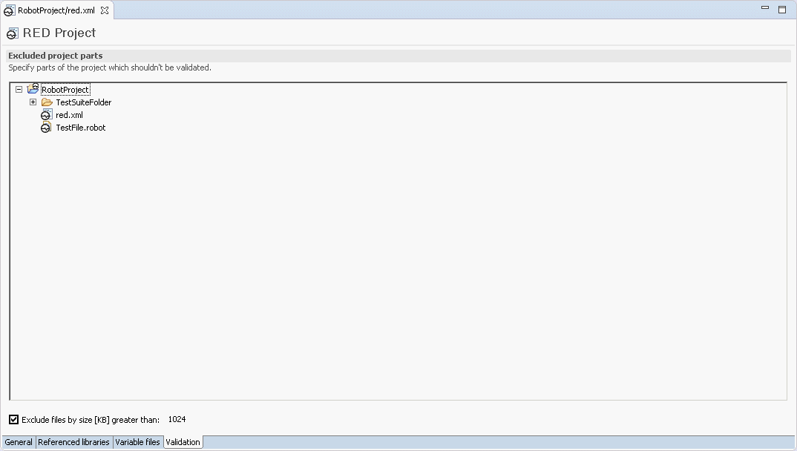

# General information about red.xml

Red.xml is file which stores Project related settings,some of those controls
editing phase (validation,code assistance etc.),other can influence
RobotFramework execution.

It is always located in Project's root.

## Creating/recreating red.xml

Red.xml is automatically created when Robot project is created by action from
_File -> New -> Robot Project_.

In case of importing robot files to generic Eclipse project, right click on
Project in Project Explorer and select "Configure as Robot project" to create
red.xml

  
  

In any case, red.xml shall be visible in Project Explorer in root folder.

## Red.xml parts

Red.xml can be viewed using default editor by double click on file. It will
load red.xml with graphical representation of file content. Alternatively,as
this is xml file,it can be viewed and edited by any text editor.

Red.xml is divided in 4 tabs: General,Referenced Libraries,Variable
files,Validation.

  
  

### General tab

This place holds settings which controls overall behavior of RED Robot Editor.

  
  

**Robot Framework** \- this section allows to set python interpreter regardless of interpreter setting in [Preferences](../launching/launch_prefs.md).

**Variables mappings** \- values can be assigned to variables, this is used to resolved parametrized paths. 

More details can be found under topic [Variable
mapping](variable_mapping.md)

### Referenced Libraries tab

  
  

This section holds anything related to libraries and RED mechanisms for
dealing with libraries.

**Referenced libraries** \- holds a list of discovered or manually added libraries in current Project.At the bottom of pane, library auto discovery settings can be changed. More detail can be found under topic [Recognizing external libraries and variable files in RED

**Paths** \- holds settings for user defined Python/ClassPath which are used for Libraries discovery and testcase execution,additionally relative paths relativity can be changed from Workspace to Project.

More info under topic [Custom python/class paths and path
relativeness](custom_paths_relatve.md)

### Variable files tab

  
  

**Variable files** \- this tab specify variable files which should be visible on global scope (Project wise). Those global variable files are used during testcase edit and running testcases by using Robot command line parameter _-V_.

More info under topic [Variable Files - using files with variable accessible
anywhere inside Project](variable_files.md).

### Validation tab

  
  

**Excluded project parts** \- this section allows user to limit validation to selected folder or exclude selected folder from validation.Files can be excluded by fixed size. To exclude folder in Project,right click on folder and choose _Exclude_ from menu. 

More info under topic [Limiting validation scope](../validation/scope.md).

[Return to Help index](http://nokia.github.io/RED/help/)
